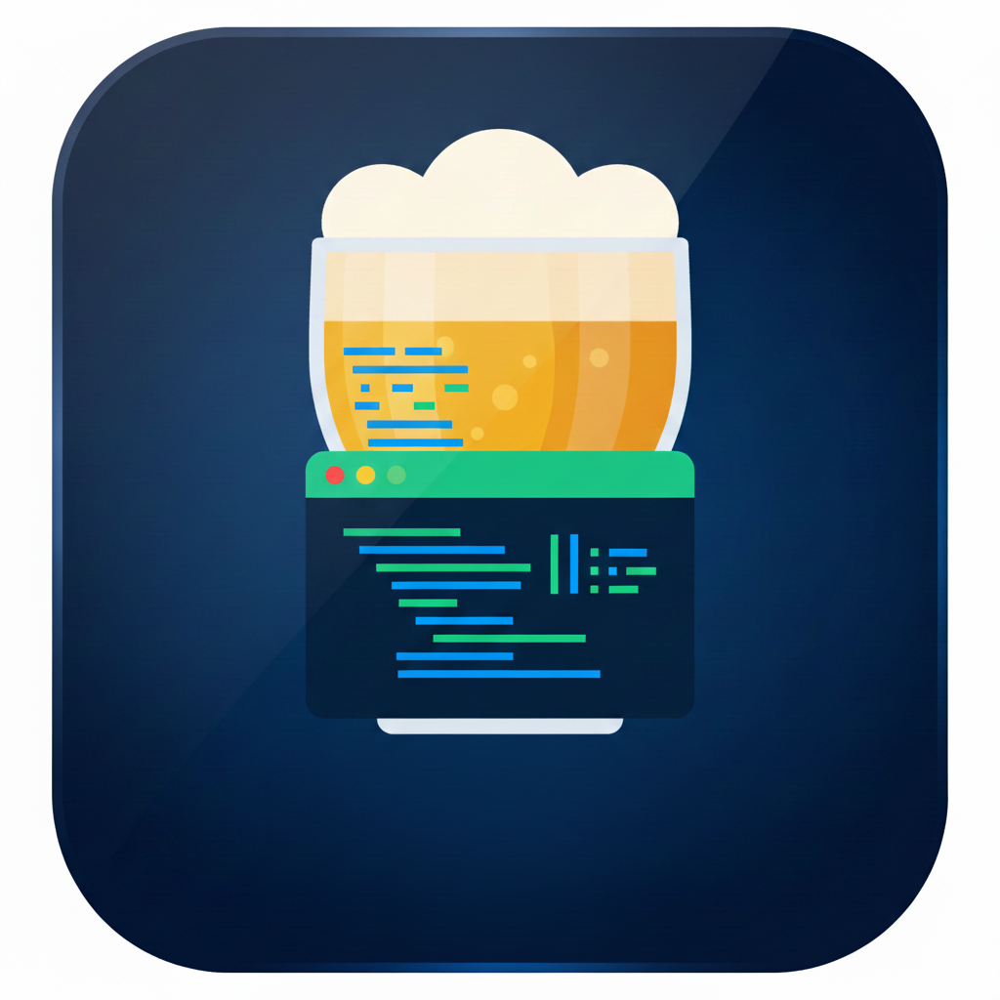

<div align="center">
  

  # Brewui

  **A native macOS GUI for [Homebrew](https://brew.sh).**

  Manage your packages, casks, taps, and bundles without touching the terminal.
</div>

---

## Overview

Brewui is a SwiftUI menu-bar-free desktop app that wraps the Homebrew CLI in a clean,
native interface. Browse and install packages, keep them up to date, manage taps, and
export/import Brewfile bundles — all while still being able to watch the underlying
`brew` commands run in a built-in console drawer.

## Features

- **Installed packages** — View and manage installed formulae and casks, with live counts,
  pin/unpin, reinstall, and uninstall.
- **Browse & search** — Search the full Homebrew catalog (backed by the
  [formulae.brew.sh API](https://formulae.brew.sh/docs/api/)) with popular-package
  suggestions and one-click install.
- **Updates** — See outdated packages at a glance with a sidebar badge, then upgrade
  individually or all at once.
- **Taps** — Add, remove, and update external Homebrew repositories.
- **Bundles** — Export your setup to a Brewfile and import bundles on another machine.
- **Homebrew details** — Inspect your Homebrew installation, run `brew doctor`,
  `cleanup`, `autoremove`, `update`, and check for missing dependencies.
- **Command console** — A collapsible drawer streams real `brew` command output in real
  time, and can auto-open on errors.
- **First-run install** — Detects whether Homebrew is present and guides you through
  installing it if it isn't.

## Requirements

- macOS (built against the macOS 26 SDK; see `MACOSX_DEPLOYMENT_TARGET` in the project)
- Xcode 16 or later
- [Homebrew](https://brew.sh) — Brewui can install it for you on first launch if missing

## Building & Running

```bash
git clone https://github.com/mckaymic/Brewui.git
cd Brewui
open Brewui.xcodeproj
```

Then select the **Brewui** scheme and press **⌘R** to build and run.

To build from the command line:

```bash
xcodebuild -project Brewui.xcodeproj -scheme Brewui -configuration Debug build
```

## Architecture

Brewui follows an MVVM structure:

| Layer | Location | Responsibility |
|-------|----------|----------------|
| **Models** | `Brewui/Models/` | Plain data types (`BrewPackage`, `Tap`, `Brewfile`, `UpdateStatus`) |
| **Views** | `Brewui/Views/` | SwiftUI screens and reusable components |
| **ViewModels** | `Brewui/ViewModels/` | Observable state and view logic |
| **Services** | `Brewui/Services/` | Homebrew integration and data access |

Key services:

- **`BrewService`** — An `actor` that wraps the `brew` CLI for all package, tap, and
  maintenance operations.
- **`ProcessRunner`** — Runs external processes with streaming output and timeouts.
- **`FormulaeAPIService`** — Fetches and caches the package catalog from the Homebrew
  Formulae API.
- **`InstalledPackagesCache`** / **`BrewfileService`** — Local caching and Brewfile
  import/export.
- **`CommandOutputManager`** — Backs the live command-output console drawer.

## Keyboard Shortcuts

| Shortcut | Action |
|----------|--------|
| ⌘⇧E | Export bundle |
| ⌘⇧I | Import bundle |
| ⌘⇧C | Show console |

## Contributing

Contributions are welcome! Please read [CONTRIBUTING.md](CONTRIBUTING.md) for guidelines
on reporting issues, proposing changes, and submitting pull requests.

## License

Brewui is released under the [MIT License](LICENSE).

> Brewui is an independent project and is not affiliated with or endorsed by the
> Homebrew project.
